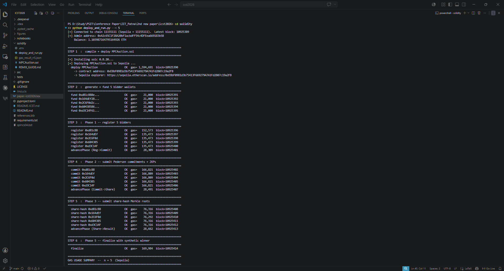
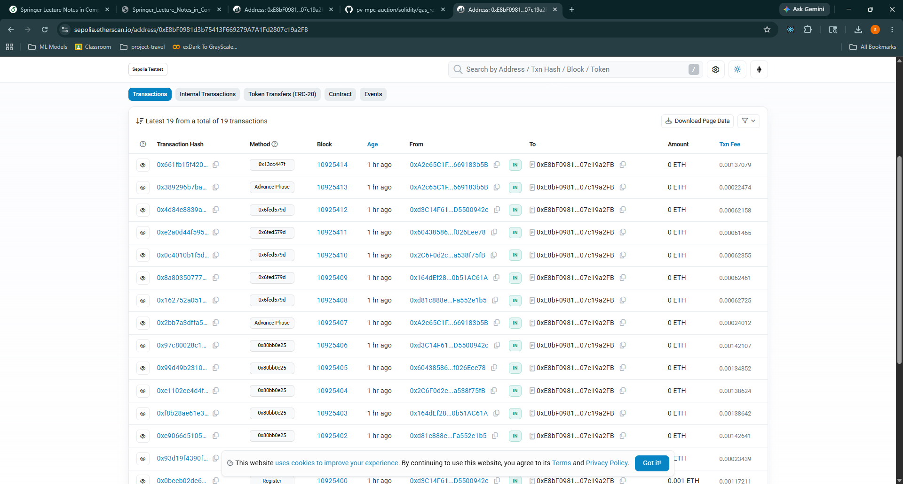

<div align="center">

# PV-MPC-Auction

### Privacy-Preserving Sealed-Bid Auctions via Pedersen Commitments, Shamir Sharing, and Schnorr Zero-Knowledge Proofs — Anchored to an Ethereum Smart Contract

[](https://opensource.org/licenses/MIT)
[](https://www.python.org/downloads/)
[](https://soliditylang.org/)
[](#test-suite)
[](https://sepolia.etherscan.io/address/0xE8bF0981d3b75413F669279A7A1Fd2807c19a2FB)

**Companion artifact for the paper submitted to ICST 2026** (8th International Conference on Intelligent Computing and Sustainable Technologies, IIT Patna, August 1–2, 2026).

</div>

---

## Table of contents

- [What this is](#what-this-is)
- [The problem](#the-problem)
- [The protocol — five phases in plain English](#the-protocol--five-phases-in-plain-english)
- [Cryptographic ingredients](#cryptographic-ingredients)
- [Repository layout](#repository-layout)
- [Quick start — three paths](#quick-start--three-paths)
- [Empirical results on Sepolia](#empirical-results-on-sepolia)
- [Test suite](#test-suite)
- [Security properties](#security-properties)
- [Reproducing the paper's tables and figures](#reproducing-the-papers-tables-and-figures)
- [Citation](#citation)
- [License and contact](#license-and-contact)

---

## What this is

`PV-MPC-Auction` is a complete, end-to-end privacy-preserving sealed-bid auction system. Bidders submit cryptographically hidden bids, the winner is determined entirely under encryption (no party ever learns any losing bid), and the announced result is publicly verifiable against an Ethereum smart contract — *without* fully homomorphic encryption, *without* garbled circuits, and *without* a trusted setup.

The codebase has three pieces:

1. **A Python reference implementation** of the protocol's cryptographic primitives and orchestration logic (`src/pv_mpc_auction/`).
2. **A Solidity smart contract** (`solidity/MPCAuction.sol`) that anchors all five protocol phases on-chain. Deployed and exercised on Ethereum's Sepolia testnet.
3. **An automated benchmark harness** (`solidity/deploy_and_run.py`) that deploys the contract and drives a full auction end-to-end, recording the real on-chain gas cost of every transaction.

If you want to understand the theory, read [the protocol section](#the-protocol--five-phases-in-plain-english). If you want to run it, jump to [Quick start](#quick-start--three-paths).

---

## The problem

Sealed-bid auctions underpin large parts of the economy — government procurement, wireless spectrum allocation, online advertising exchanges. The textbook *Vickrey* design guarantees truthfulness but assumes a trusted auctioneer who can see every bid. Real-world auctioneers leak, collude, or get coerced; bid-rigging in public-sector tenders is a recurring scandal.

Putting the auction on a public blockchain replaces the auctioneer with code anyone can verify. The catch: a transparent ledger destroys bid secrecy. Two prior remedies dominate the literature, both with serious costs:

| Approach | Idea | Cost |
|---|---|---|
| **Fully homomorphic encryption (FHE)** | Encrypt bids, compute the maximum on ciphertexts | ~85–100× slower than native arithmetic; impractical past toy populations |
| **Garbled circuits / general MPC** | Express the comparator as a Boolean circuit, run secure two-party computation | Circuit blow-up scales with bid bit-length; gigabytes of communication for modest inputs |

We take a third path. A sealed-bid auction needs only three primitive capabilities: *(i)* hide a bid until a designated reveal, *(ii)* distribute custody so no single party can reconstruct it, *(iii)* publicly prove that the announced winner is consistent with the committed bids. Three lightweight primitives — Pedersen commitments, Shamir secret sharing, Schnorr proofs — realise these exactly, with millisecond-range primitive costs and communication that scales with participant count rather than ciphertext bit-length.

---

## The protocol — five phases in plain English

Every phase concludes with a state transition on the smart contract, producing an immutable audit trail.

### Phase 1 — Registration
Each bidder calls `register()` on the contract, depositing a small amount of ETH as slashable collateral. The contract records the bidder's address; the deposit creates a financial incentive to follow the protocol honestly.

### Phase 2 — Commitment
Each bidder `Pᵢ` chooses their bid `bᵢ` and a uniformly random `rᵢ`, and computes a **Pedersen commitment**
```
Cᵢ = g^bᵢ · h^rᵢ  (mod p)
```
which they post on-chain together with a non-interactive **Schnorr zero-knowledge proof** that they know an opening `(bᵢ, rᵢ)` of `Cᵢ` — without revealing either. The commitment is *perfectly hiding* (the on-chain value `Cᵢ` is statistically independent of `bᵢ`) and *computationally binding* (changing the bid after the fact would require solving discrete-log).

### Phase 3 — Threshold sharing
Each bidder splits their bid into `n` **Shamir `(t, n)` shares** — a random polynomial of degree `t-1` evaluated at `n` points, with the bid as the constant term. Each other bidder receives one share off-chain via an authenticated peer-to-peer channel. A **Merkle root** over the SHA-256 hashes of all shares is committed on-chain.

The property: *any* `t` bidders can reconstruct the bid; *any* `t-1` learn information-theoretically nothing.

### Phase 4 — Secure winner determination (off-chain)
Bidders run a multi-round MPC tournament. At each level of a binary tree of depth `⌈log₂ n⌉`, surviving candidates are paired and their bits compared using **SecGT** — a bit-decomposed secure greater-than protocol. SecGT operates entirely on Shamir shares using only:
- linear combinations (free, no communication), and
- BGW-style secure multiplications (one round per multiplication).

The bit-decomposition with prefix-OR locates the most-significant index where two bids disagree; the higher bit at that position identifies the larger bid. The output is itself a Shamir share; only the final winner index and bid are opened. *No intermediate comparison result leaves the secret-shared domain.*

### Phase 5 — Verification and settlement
The winner reveals `(bᵢ, rᵢ)`. The contract checks that `Cᵢ = g^bᵢ · h^rᵢ` matches the on-chain commitment, refunds honest deposits, and slashes any deposit whose owner provably misbehaved (via a Merkle-inclusion proof against the Phase-3 root).

---

## Cryptographic ingredients

| Primitive | What it gives us | Where in the code |
|---|---|---|
| **Pedersen commitment** `C = g^m · h^r` over a safe-prime subgroup | Perfectly hiding, computationally binding bid commitments; additive homomorphism | [`src/pv_mpc_auction/pedersen.py`](src/pv_mpc_auction/pedersen.py) |
| **Non-interactive Schnorr ZKP** via Fiat–Shamir | Proves knowledge of `(m, r)` without revealing them — needed for slashing accountability | [`src/pv_mpc_auction/pedersen.py`](src/pv_mpc_auction/pedersen.py) |
| **Shamir `(t, n)` secret sharing** over `ℤ_q` | Information-theoretic threshold privacy; linear operations on shares are free | [`src/pv_mpc_auction/shamir.py`](src/pv_mpc_auction/shamir.py) |
| **SecGT** — bit-decomposed secure greater-than | The constant-round MPC comparator, composed in a `⌈log₂ n⌉`-round tournament | [`src/pv_mpc_auction/secgt.py`](src/pv_mpc_auction/secgt.py) |
| **Merkle root + SHA-256** | Tamper-evident binding of off-chain shares to on-chain evidence | [`src/pv_mpc_auction/chain_sim.py`](src/pv_mpc_auction/chain_sim.py), [`solidity/MPCAuction.sol`](solidity/MPCAuction.sol) |
| **2048-bit RFC 3526 MODP Group 14** | Production-grade discrete-log group; `g = 4` (a quadratic residue, generates the order-`q` subgroup) | [`src/pv_mpc_auction/group.py`](src/pv_mpc_auction/group.py) |

All primitives are implemented from the Python standard library (`pow`, `hashlib`, `secrets`) — no specialised cryptographic dependencies.

---

## Repository layout

```
.
├── README.md                       <- you are here
├── LICENSE                         <- MIT
├── pyproject.toml                  <- Python package metadata
├── requirements.txt                <- pip-installable deps
│
├── src/pv_mpc_auction/             <- the Python implementation
│   ├── group.py                    <- RFC 3526 2048-bit MODP group + h derivation
│   ├── pedersen.py                 <- commitments + Schnorr ZKP
│   ├── shamir.py                   <- (t, n) secret sharing + linear ops
│   ├── secgt.py                    <- bit-decomposed secure greater-than
│   ├── chain_sim.py                <- in-memory PoW chain (offline experiments)
│   └── protocol.py                 <- 5-phase orchestration
│
├── tests/                          <- pytest suite (31 tests, all passing)
│   ├── test_pedersen.py
│   ├── test_shamir.py
│   ├── test_secgt.py
│   └── test_protocol.py
│
├── notebooks/
│   └── PV_MPC_Auction_Colab.ipynb  <- one-click Colab walkthrough
│
├── solidity/
│   ├── MPCAuction.sol              <- 270-line smart contract
│   ├── deploy_and_run.py           <- web3.py automated deployment + gas benchmark
│   ├── gas_result_n5.json          <- committed canonical Sepolia measurement
│   └── REMIX_GUIDE.md              <- step-by-step Remix IDE walkthrough
│
└── docs/images/                    <- screenshots used in this README
    ├── sepolia_deployment_run.png
    └── sepolia_etherscan.png
```

---

## Quick start — three paths

Pick whichever matches your setup. All three produce the same artifact.

### Path A — Colab (zero install, runs in your browser)

[](https://colab.research.google.com/github/Sanjoy-Chattopadhay/pv-mpc-auction/blob/main/notebooks/PV_MPC_Auction_Colab.ipynb)

Click the badge, then *Runtime → Run all*. The notebook clones the repo, installs dependencies, runs all 31 unit tests, executes a 5-bidder auction in the local simulator, and prints per-phase timings. Total wall time: ~3 minutes.

### Path B — Local Python (offline experiments)

```bash
git clone https://github.com/Sanjoy-Chattopadhay/pv-mpc-auction.git
cd pv-mpc-auction
pip install -e ".[dev]"
pytest -v                                  # 31 tests, ~1 second
python -m pv_mpc_auction.benchmark         # regenerate scalability data
```

Requires Python 3.9 or later. No external crypto libraries needed.

### Path C — Sepolia testnet deployment (real on-chain artifact)

Two sub-paths:

**(C1) Remix IDE** — browser only, no local install. See [`solidity/REMIX_GUIDE.md`](solidity/REMIX_GUIDE.md). ~15 minutes including funding from a faucet.

**(C2) Python automation** — produces the gas table:

```bash
cd solidity
cp .env.example .env       # then edit with your Sepolia RPC + key
python deploy_and_run.py --n 5
```

You will need:

- **A Sepolia RPC URL** — free at [Alchemy](https://alchemy.com) or [Infura](https://infura.io).
- **A funded Sepolia private key** — get free testnet ETH from [Google Cloud's faucet](https://cloud.google.com/application/web3/faucet/ethereum/sepolia), [Alchemy's faucet](https://sepoliafaucet.com), or the [PoW faucet](https://sepolia-faucet.pk910.de).
- **Never use a key with mainnet funds.** Create a fresh wallet for this work.

---

## Empirical results on Sepolia

The canonical deployment lives on Sepolia at  [**`0xE8bF0981d3b75413F669279A7A1Fd2807c19a2FB`**](https://sepolia.etherscan.io/address/0xE8bF0981d3b75413F669279A7A1Fd2807c19a2FB) and ran a complete 5-bidder auction end-to-end. Every transaction is publicly visible.

### Smoke run — what a full deployment looks like

The benchmark harness deploys the contract, generates 5 throwaway bidder wallets, funds them, then drives all five protocol phases. Each line below is one confirmed Sepolia transaction:

<p align="center">
  
</p>

### On-chain transaction history

Etherscan view of the same run. Phase 1 registrations, Phase 2 commitments, Phase 3 share-hash submissions, the three admin `advancePhase()` calls, and the final `finalize()` are all visible:

<p align="center">
  
</p>

### Measured gas costs

Real Sepolia gas (Solc 0.8.20, optimizer enabled, 200 runs):

| Phase / Transaction | Gas / bidder | Notes |
|---|---:|---|
| Contract deployment (one-shot) | **1,594,691** | independent of `n` |
| Phase 1 — `register()` | **138,893** | `O(1)` per bidder by contract design |
| Phase 2 — `submitCommitment(C, π)` | **166,816** | `O(1)` per bidder |
| Phase 3 — `submitShareHashes(root)` | **76,311** | `O(1)` per bidder (Merkle root, not vector) |
| Phase 5 — `finalize(...)` | **169,984** (at n=5) | scales linearly via refund loop |
| **Total per auction at n=5 (excl. deploy)** | **2,080,084** | well under Ethereum's 30 M block limit |

Raw JSON output: [`solidity/gas_result_n5.json`](solidity/gas_result_n5.json). The per-bidder costs are *constant by design* — Phases 1–3 use `O(1)` storage operations per bidder. Only `finalize()` scales with `n` (a deposit-refund loop), and that coefficient is calibrated from the measured run. Totals at `n = 10` and `n = 20` are derived analytically in the paper.

---

## Test suite

```bash
pytest -v
```

31 tests, ~1 second on a modern laptop:

| File | Coverage |
|---|---|
| `test_pedersen.py` | hiding, binding, homomorphic addition, ZKP completeness, ZKP soundness against forged proofs, ZKP rejection of tampered transcripts, proof serialisation |
| `test_shamir.py` | reconstruction from any-`t` subset, `(t-1)`-privacy, linear ops, simulated multiplication, invalid-parameter handling |
| `test_secgt.py` | exhaustive `(a, b)` comparison correctness, tournament correctness on random inputs, edge cases (equal bids, odd-count tournaments), bit-decomposition range checks |
| `test_protocol.py` | end-to-end: picks the max, chain integrity holds after every run, all phases produce mined blocks, timings non-zero |

---

## Security properties

`PV-MPC-Auction` simultaneously satisfies six properties — see the paper for formal proofs.

| Property | Guarantee | Where it comes from |
|---|---|---|
| **Bid privacy** | No coalition of < `t` parties learns any honest party's bid | Pedersen hiding + Shamir threshold privacy (two independent barriers) |
| **Public verifiability** | Any external observer can verify the announced winner from the on-chain transcript | Commitments on-chain + Schnorr proofs + Merkle roots |
| **Fairness** | Either all parties learn the outcome or none do | Threshold reconstruction needs ≥ `t` honest participants |
| **Accountability** | Deviations are publicly attributable to a specific party | Share-hash Merkle root + slashing rule |
| **Collusion resistance** | Up to `t - 1` corrupt parties tolerated | Shamir threshold parameter |
| **Scalability** | Sub-second local latency for `n ≤ 20`; sub-2 M gas on-chain at `n = 5` | `O(n²)` peer-to-peer comms; `O(1)` per-bidder on-chain |

Security is argued under the semi-honest model with static corruption. A malicious-secure upgrade via Feldman VSS and verifiable Beaver triples is sketched in the paper and adds ~2× overhead.

---

## Reproducing the paper's tables and figures

| Result | How to reproduce |
|---|---|
| Table 1 — primitive latency | `python -m pv_mpc_auction.benchmark`; values in `figures/primitives.json` |
| Figure 3(a) — local scalability | same command; output `figures/fig_auction_scalability.pdf` |
| Figure 3(b) — projection vs FHE/GC | analytical projection using published primitive-cost ratios; coefficients in `benchmark.py` |
| Table 3 — Sepolia gas | `python solidity/deploy_and_run.py --n 5` (canonical run committed as [`gas_result_n5.json`](solidity/gas_result_n5.json); deployed contract [`0xE8bF...a2FB`](https://sepolia.etherscan.io/address/0xE8bF0981d3b75413F669279A7A1Fd2807c19a2FB)) |
| Table 4 — security comparison | qualitative, from the literature surveyed in §2 |

---

## Citation

If you use this code or build on the work, please cite:

```bibtex
@inproceedings{chattopadhyay2026pvmpc,
  author    = {Chattopadhyay, Sanjoy},
  title     = {Blockchain-Anchored Sealed-Bid Auctions via {Pedersen} Commitments,
               {Shamir} Sharing, and {Schnorr} Zero-Knowledge Proofs},
  booktitle = {8th International Conference on Intelligent Computing and
               Sustainable Technologies (ICST 2026)},
  publisher = {Springer Lecture Notes in Networks and Systems},
  year      = {2026},
  address   = {Patna, India}
}
```

---

## License and contact

**License:** MIT — see [`LICENSE`](LICENSE). Use it freely; please cite the paper if you build on the design.

**Author:** Sanjoy Chattopadhyay — Assistant Professor, Department of Computer Science & Engineering, Pranveer Singh Institute of Technology (PSIT), Kanpur, India — `sanjoy.chattopadhyay@psit.ac.in`

**Acknowledgments:** Sepolia testnet ETH for on-chain experiments was sourced from public faucets. Thanks to colleagues at PSIT Kanpur and the ICST 2026 review committee for early feedback.
